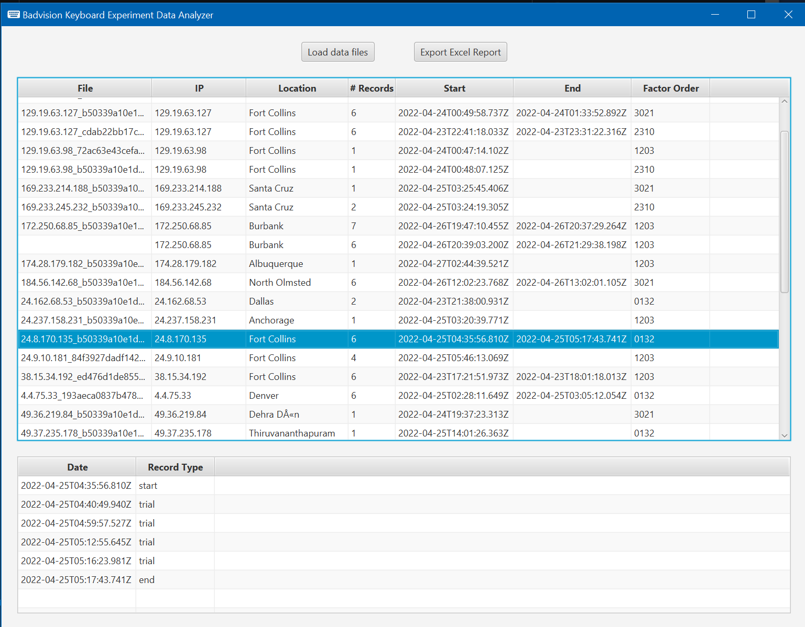
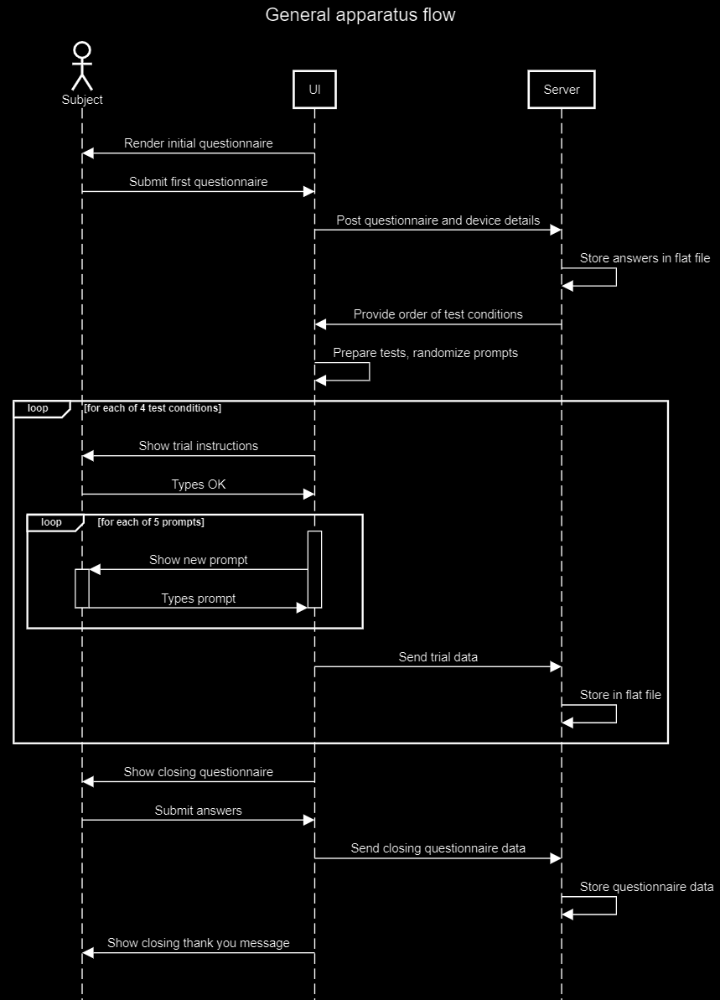

## Introduction

The Badvision keyboard experiment compares two keyboards, a standard QWERTY and a Metropolis keyboard originally designed by Zhai and Smith. In addition, lighted hints are tested for any additional improvements to accuracy or speed.

## Run project

The experiment is contained in a single webpage, enabling a diverse geolocated subject pool. Participating subjects access the page on a tablet device, which is the only required equipment.

The starting page explains the time required and experiment process. This hopefully reduces confounding factors by instructing the subject to have a distraction-free environment to sit while participating.

The initial questionnaire collects demographics as well as device details.  After submission, the server records data and provides an ordering of 4 test conditions, assigned by balanced Latin squares.

## Example browsers;

### Tesla

### Surface pro

## How do related experiments work

At the beginning of each trial, test conditions are explained briefly. The keyboard corresponding to current test conditions is displayed and the subject types OK to start. This serves as a quick practice to introduce each keyboard.

In each experiment trial, 5 random phrases are presented on-screen one at a time. The user types each prompt using the provided keyboard. Input appears above the keyboard while typing and the prompt letters change color to aid tracking.

No backspace is provided, but input is tolerant of typographic errors and skips. This allows easier analysis of errors overall.  After completing a prompt, a new prompt will appear until all five are entered.

After testing, a closing questionnaire elicits user feedback followed by a final thank you message indicating completion.

## Data processing

Data processing is provided by an additional Data Analysis tool, which can be built and executed via Maven.  This is a JavaFX application requiring Java 11 and Apache Maven, and does not work headlessly (e.g. don't run it from an ssh session.)  To execute, open a terminal and change to the data analaysis folder.  Then execute the command `mvn javafx:run` to launch the application.  

Select the data folder containing all the collected data files.  Then click the export button to write a summary xlsx file in the same folder.  Note: THIS WILL OVERWRITE THE REPORT.XLSX FILE SO DON'T EXPORT UNLESS YOU ARE OK WITH THAT.

## Bugs and Errata 

The experiment is fully defined but during use some issues became apparent in the various software written for this experiment:
   - The Markov chain generator outputs slightly in a different format than needed in the javascript coding.  Since this was a one-shot tool, I just manually cleaned the data structures and used my IDE to reformat the final file.
   - The raw data files are JSON arrays but do not start or end with square brackets and the final line of each file has an extra comma as well.  The data analaysis tool handles this but trying to use these files through other tools like JQ means you have to alter a copy of the data files first.
   - 10% of the prompts had commas but the keyboards initially had no commas.  This was added.  The subject reporting the issue did not complete the exercise and was not included in the data analysis.  Other subjects were not impacted.
   - Especially iPad users reported issues with double-tapping activating the built-in zoom feature of their browser.  This impacted all trials equally but was not intended to be part of the experiment.  It is likely that the standard deviation of some subjects reflects this anomaly but the overall p-values and trends were not impacted in a significant way during data analysis.
   - It is possible for subjects to quickly key in extra keys after finishing a prompt and these extra keystrokes (such as spaces typed habitually) show in the data as extra keystrokes with no associated type, therefore do not count as correct, incorrect or skipped keys.  The impact on WPM calculation is negligible since it happens in a sub-second window of time.
   - It is possible that subjects are appended to the same data file if they have the same source IP address and have no tracking cookies to uniquely identify them.  Fortunately of the two times this appeared the subjects were not participating simultanesouly so the data was not interleaved.
   - Experiment data analaysis tool does not indicate when it is finished exporting the excel spreadsheet.  It's nearly instantaneous, but you have to monitor STDOUT/STDERR if there are errors that interfere with saving the file.
   - Some of the generated statistics in excel anova sheets are meaningless; specifically the "combined" and "null" were different attempts to combine and process the data in different ways but ultimately proved to be nonsense.

## Code description

Keyboard hints are provided via a Markov chain model, generated by a python workbook from the set of prompts used in the experiment. The prediction model is only based on the previous 1 or 2 characters, sufficient to offer at least 3 or 4 predictions. These are not meant to challenge best-of-breed predictive models but to provide an ideal simulation so the user is not distracted by poor recommendations and locate the correct key.

Apparatus code is written in ECMA 6, with Node.JS on the server side to handle data storage via flat files. The page itself is HTML, with questionnaires and layout placeholders in the markup. The javascript handles the application state, showing and hiding questionnaires, and finally running each of the trial conditions, rendering the keyboards, etc.  Keyboards themselves are laid out using flexbox markup and CSS styling. Likewise the hints and keypress styles are all CSS-driven. At the very start, all phrases are shuffled using Durstenfeld's algorithm and divided into sets of 5.

When submitting questionnaires,  the browser includes device details as well as timestamps in the recorded data.  Once each trial begins, the browser collects the timestamp when a prompt appears, and the timestamps of each successive keystroke. It also records if a key was correct, incorrect, or skipped. Other data about the original prompt vs. typed response is also retained. At the end of each trial the recorded data is sent to the server and recorded for later analysis.

## Objective of what I am doing

Ultimately I want to reproduce the near 50-wpm performance of Metropolis keyboard that Zhai and Smith reported. I also want to demonstrate how highlighted key suggestions improve performance because  modern gaming keyboards can adopt this feature. Additionally feedback from subjects with regular typing difficulties is valuable to determine if further application of Metropolis offers a social benefit.

## Process flow

*Note:* Render with [sequencediagram.org](https://sequencediagram.org)

    title General apparatus flow

    actor Subject

    UI->Subject: Render initial questionnaire
    Subject->UI: Submit first questionnaire
    UI->Server: Post questionnaire and device details
    Server->Server:Store answers in flat file
    Server->UI: Provide order of test conditions
    UI->UI: Prepare tests, randomize prompts
    loop for each of 4 test conditions
    UI->Subject: Show trial instructions
    Subject->UI: Types OK
    loop for each of 5 prompts
    activate UI
    UI->Subject: Show new prompt
    activate Subject
    Subject->UI: Types prompt
    deactivate Subject
    deactivate UI
    end 
    UI->Server: Send trial data
    Server->Server: Store in flat file
    end
    UI->Subject: Show closing questionnaire
    Subject->UI: Submit answers
    UI->Server: Send closing questionnaire data
    Server->Server: Store questionnaire data
    UI->Subject: Show closing thank you message
